# Inhalt des Ordners `img`

Quellen:

* https://opengameart.org/
* http://untamed.wild-refuge.net/rmxpresources.php?characters
* https://phaser.io/
* https://goglilol.itch.io/cute-knight

## backgrounds

sky.png

## character-plattformer

dude.png

sheet_hero_idle.png

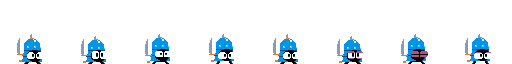

## character-rpg
astromechdroid.png

captainamerica_shield.png

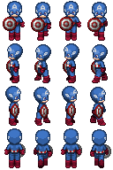

deadpool.png

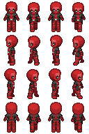

loki.png

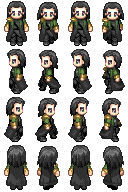

luke.png

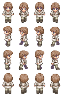

moderngirl02.png

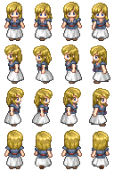

nightelf_female1.png

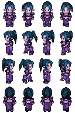

nightelf_female2.png

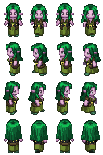

pirate_f2.png

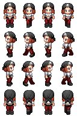

pirate_m1.png

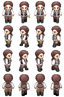

protocoldroid1.png

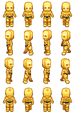

snowwhite.png

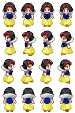

stormtrooper.png

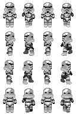

tremel.png

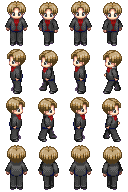

yoda.png

## objects
bomb.png

coins.png

star.png

