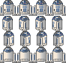
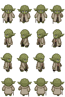

# Inhalt des Ordners `img`

Quellen:

* https://opengameart.org/
* http://untamed.wild-refuge.net/rmxpresources.php?characters
* https://phaser.io/
* https://goglilol.itch.io/cute-knight

## backgrounds

sky.png

## character-plattformer

dude.png

sheet_hero_idle.png

## character-rpg
astromechdroid.png

captainamerica_shield.png

deadpool.png

loki.png

luke.png

moderngirl02.png

nightelf_female1.png

nightelf_female2.png

pirate_f2.png

pirate_m1.png

protocoldroid1.png

snowwhite.png

stormtrooper.png

tremel.png

yoda.png

## objects
bomb.png

coins.png

star.png

