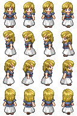

# gamelib.js

*gamelib.js is a game libary for german speaking students.*

gamelib.js dient ausschließlich zu Lehrzwecken. Für professionelle Entwicklung in JavaScript gibt es weit besser geeignetere (und komplexere) Bibliotheken. Etwa [phaser.io](https://phaser.io/) oder [melonJS](www.melonjs.org/) (mehr bei [GitHub](https://github.com/collections/game-engines)).


Demos:

* [RPG (Role Playing Game oder "Adventure")](https://wi-wissen.github.io/gamelib.js/demo-rpg.html) - [Source](demo-rpg.html)
* [Plattformer ("Hüpfespiel")](https://wi-wissen.github.io/gamelib.js/demo-platform.html) - [Source](demo-platform.html)

## Vorraussetzungen

Aus Sicherheitsgründen wird dein Webbrowser die Webseite nur anzeigen, wenn sie von einem Server ausgeliefert wird. Bitte ändere diese nicht, sondern verwende einen Server.

Hast du gerade keinen Server zur Hand, kannst du folgendes tun:

1. Öffne Chrome
2. Installiere das Addon [Web Server for Chrome](https://chrome.google.com/webstore/detail/web-server-for-chrome/ofhbbkphhbklhfoeikjpcbhemlocgigb)
3. Starte das Addon und wähle mit `CHOOSE FOLDER` den Ordner mit deinen Dateien aus
4. Rufe [http://127.0.0.1:8887](http://127.0.0.1:8887/) in deinem Browser auf

## Installation

1. Lade das komplette Repository herunter. 
2. Erstelle eine index.html mit folgenden Inhalt: 

```html
<!DOCTYPE html>
<html>

<head>
    <meta charset="utf-8">
    <title>GameLib</title>
    <link href='css/gamelib.css' rel='stylesheet'>
</head>

<body>

    <game></game>

    <script src="js/gamelib.js"></script>
    <script>
        (async function () {
            //dein Spiel
        })()
    </script>

</body>

</html>
```

Erstelle dein Spiel, dort wie `//dein Spiel` steht.

## Klassen

Im folgenden werden nur dich wichtigen Klassen und Funktionen beschrieben. Alle siehst du bei einem Blick in `js/gamelib.js`

### `World`

Die Welt verwaltet alle Figuren und kümmert sich, um alle Hintergrundaufgaben.

Neue Welt erstellen:

```js
var world = new World("game", 400, 200);
```

Dieser Befehl legt eine neue Welt an, welche im html-Element `<game>` erstellt wird. Diese ist 400x200 Pixel groß.

#### Attribute

`background` - hier kannst du eine Darstellung für den Hintergrund festlegen, welche das sein kann findest du unten im Abschnitt Darstellungen

#### Funktionen

`async play()` - Startet das Spiel. Dieser Befehl darf erst aufgerufen werden, wenn alle Figuren hinzugefügt wurden.

`stop()` - Stopt das Spiel.

`getEntity(name)` - Gibt dir eine Figure zurück.

`removeEntity(figure)` - Entfernt die Figure aus der Welt. Das eigentliche Objekt bleibt dabei erhalten.

`removeAllEntities()` - Entfernt alle Figuren. Praktisch, wenn etwa eine neue Welt geladen werden soll.

`addEntity(figure)` - fügt eine Figur hinzu.

### `Figure` (erbt von `Entity`)
Erstellt eine neue Figur:

```js
var player = new Figure(50, 110, 64, 64, img);
```

Erstellt eine Figur, welche an der Position (50, 110) mit der Größe (64, 64) mit der Darstellung `img` .

#### Attribute

`x` - Position auf der x-Achse

`y` - Position auf der y-Achse

`height` - Höhe

`width` - Breite

`img` - Darstellung, siehe Abschnitt Darstellungen

`type` - Typ. Kann frei gewählt werden. Bei Kolliosionen praktisch (Etwa "Gegner" oder "Schatz")

`world` - Hierüber kann eine Figure auf Attribute und Funktionen der beinhaltenden Welt zugreifen.

#### Funktionen
`move(x,y)`  - Bewegt die Figur um x und y Pixel.

`collidate(obj)` - Diese Funktion wird aufgerufen, wenn etwas mit diesem Objekt kollidiert. Hier können etwa Lebenspunkte abgezogen werden. Am Ende gibst du mit `return` zurück, ob die Kollision zulässig (`true`) oder nicht (`false`) ist. Also darf das Objekt auf der gleichen Position sein? Das kann etwa bei Text oder einem Hintergrundbild sinnvoll sein. Sobald eins der beiden betroffenen Objekte eine Kollision zurückmeldet, wird die Bewegung unterbunden. Beachte bitte, dass diese Funktion mehrmals in der Sekunde aufgerufen wird, wenn die Kollision fortbesteht.

`update()` - Diese Funktion wird aller 16 Milisekunden (also annähernd 60x je Sekunde) aufgerufen. Hier könnte etwa bei Hüpfespielen die Schwerkraft geprüft werden.

### Darstellungen

Du findest im Ordner `img` [viele Bilder](img.md) zum Durchstarten.


Aktuell gibt es vier Möglichkeiten ein Objekt darzustellen:

`StaticBackground` - Setzt eine Hintergrundfarbe: 

```js
world.background = new StaticBackground("#558b6e", 400, 200);
```

Farbe `#558b6e` mit der Größe 400x200 Pixel.

`StaticText` - Schreibt einen beliebigen Text und errechnet selbst die neue Größe des Objektes:

```js
var img =  new StaticText("Hello World!");
```

Mit `fontSize `, `fontFamily `, `fillStyle ` und `textAlign ` lässt sich die Schrift anpassen.

Als Schriftarten sind neben den auf den Rechner vorhandenen noch [Coda Caption](https://fonts.google.com/specimen/Coda+Caption),  [Knewave](https://fonts.google.com/specimen/Knewave) und [Gaegu](https://fonts.google.com/specimen/Gaegu) enthalten, welche das Spiel stimmungsvoller wirken lassen.

`StaticImg` - Zeigt ein einzelnes Bild an:

```js
var img = new StaticImg("img/static-hero.png", 32, 32)
```

Das Bild wird relativ zur html-Datei mit den Maßen 32x32 Pixel angezeigt.

`Sprite` - Hier wird eine Serie an Bildern durchlaufen, sodass eine Animation entsteht:

```js
var sprite = new Sprite("img/character-rpg/moderngirl02.png", 32, 48));
sprite.costumes["down"] = [0, 1, 2, 3];
sprite.costumes["left"] = [4, 5, 6, 7];
sprite.costumes["right"] = [8, 9 ,10,11];
sprite.costumes["up"] = [12,13,14,15];
sprite.costumes["idle"] = [0];
sprite.costume = "idle";
```

Es wird ein Bild relativ zur html-Datei geladen mit den Maßen 32x48 Pixeln. Dabei wird das Bild in diese Bildteile zerlegt. Je nach Bewegung können verschiedene Teilbilder ausgewählt werden. In der letzten Zeile wird die aktuelle Bewegung festgelegt.

Die Bilder werden dabei der Reihe nach gezählt:



`StaticNothing ` - Und schon hast du ein unsichtbares Objekt:

```js
this.img = new StaticNothing(this.width, this.height);
```

Ändert das eigene Bild, sodass das Objekt nicht mehr zu sehen ist.

### Hilfsfunktionen
`await sleep(ms)` lässt die aktuelle Aufgabe um `ms` Milisekunden pausieren. Beachte bitte, das dies wirklich nur auf die aktuelle Aufgabe zutrifft. Zudem muss die aufrufende Funktion als `async` markiert sein.


## ToDo

* [ ] Gridsystem vollständig implementieren
* [ ] Helfer für Musik und Töne
* [ ] Tasteneingaben sollen nur im `canvas` und nicht auf der gesamten Webseite abgefangen werden


## Lizenz

Bitte beachte, dass die [Grafiken](img.md) und [Schriften](https://fonts.google.com/) von den jeweiligen Urhebern unter verschiedenen Lizenzen veröffentlicht wurden.

Die Bibliothek ist unter [Mozilla Public License 2.0 (MPL)](https://choosealicense.com/licenses/mpl-2.0/) veröffentlicht. Grob gesagt, kannst du alles damit machen, musst aber  die Bibliothek auch mit deinen Änderungen unter den gleichen Bedingungen weitergeben und mich als (Mit-)Urheber nennen. Bei Software reicht ein Link auf dieses Repository. In gedruckten Werken wird im namentliche Nennung wie andere Autoren gebeten.